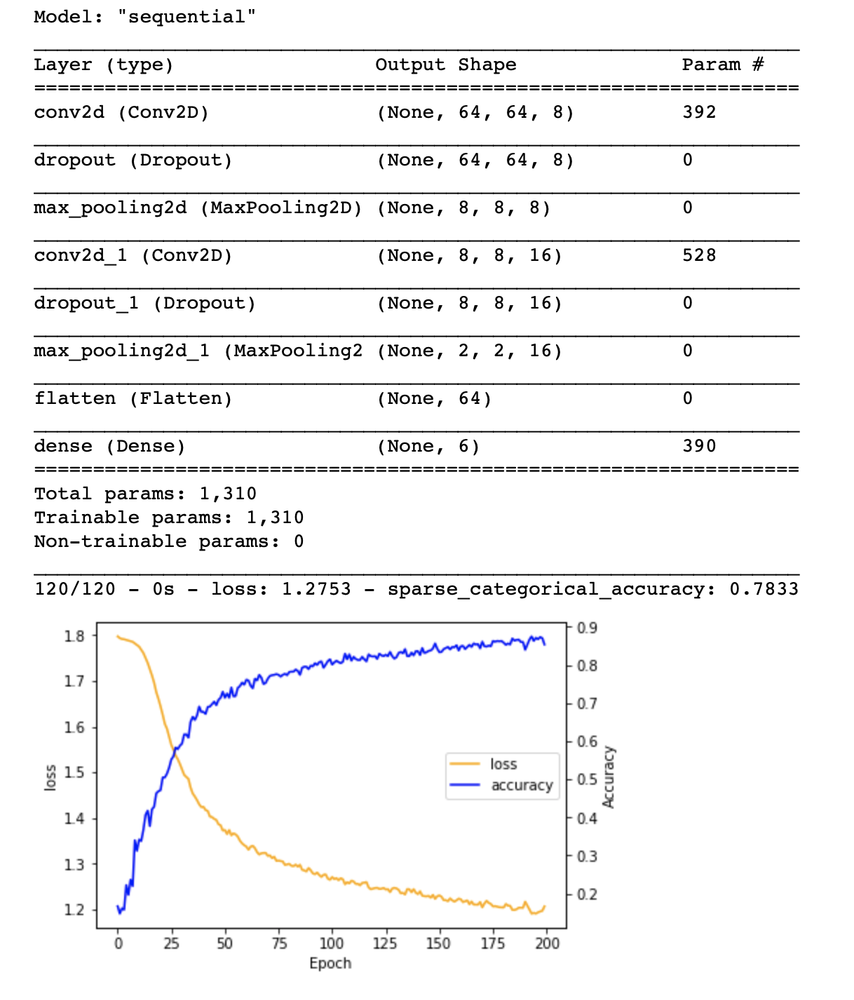
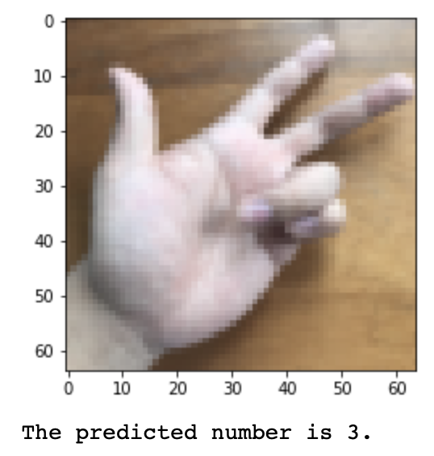

# tensorflow_CNN
An implementation of convolutional neural network using tensorflow. We acknowledge **deeplearning.ai** for inspiring the program and providing the data set.

Here, we would demonstrate recognizing a single hand gesturing numbers. We adopt a convolutional neural network to analyze sample of 64 px by 64 px images with RGB channels. The model is as follow:

We also show the graphical representation of the graph. We first pass the image through 8 sets of 4 by 4 filters. Then we regularize the result with a 10% dropout. Following we pass the result through a 8 by 8 max pooling. After that, we the result through 16 sets of 2 by 2 filters, and the result is again regularized by 10% dropout. Then we pass it to 4 by 4 max pooling. Lastly the result is generated through a fully connected layer with softmax activation.

There are 1310 trainable parameters in total, as we have demonstrated in the following figure. We run the model in 64 minibatches over 200 epoches. We have plot the loss and accuracy metric as a function of epoches to see the learning outcome. We didn't saturate the loss given our hyperparameter settings because we want to save computational time for this demonstration purpose.

After the training, we test our CNN model with new test images. We output the test image and the CNN prediction to see if how well the result is predicted.

